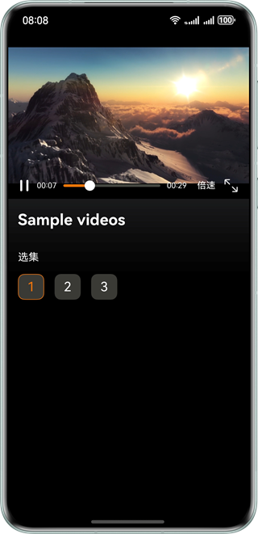

# 基于Surface模式进行视频播放控制

## 项目介绍
本实例基于AVCodec能力实现Surface模式下的视频播控功能，通过调用Native侧解码器与解封装能力，完成视频播放、暂停、进度调整、资源切换及倍速播放等核心操作；可帮助开发者理解并掌握Surface模式下视频解码能力及解码流程的开发方法。
## 效果预览

| 应用主界面                                              |
|----------------------------------------------------|
|  |

## 使用说明

1. 进入首页后，点击下方的选集按钮进行播放，播放中点击不同的选集可切换视频播放。
2. 播放界面中，点击左侧播放和暂停按钮可控制视频播放状态。
3. 滑动进度条可调整视频播放进度。
4. 点击倍速按钮可进行视频播放速度切换。
5. 点击全屏播放按钮可进行视频横向全屏播放。

## 工程目录

```       
├──entry/src/main/cpp                 // Native层
│  ├──capabilities                  // 系统解码能力
│  │  ├──include                
│  │  │  ├──AudioDecoder.h         // 音频解码能力接口
│  │  │  ├──CodecCallback.h        // 解码回调接口
│  │  │  ├──Demuxer.h              // 解封装能力接口       
│  │  │  └──VideoDecoder.h         // 视频解码能力接口
│  │  └──src
│  │     ├──AudioDecoder.cpp       // 音频解码能力实现
│  │     ├──CodecCallback.cpp      // 解码回调实现
│  │     ├──Demuxer.cpp            // 解封装能力实现       
│  │     └──VideoDecoder.cpp       // 视频解码能力实现
│  ├──common                       // 解码公共工具
│  │  └──include      
│  │     ├──AudioSampleInfo.h      // 音频解码数据信息   
│  │     ├──MediaError.h           // 异常转态枚举
│  │     ├──MediaLog.h             // 宏定义日志
│  │     ├──SampleInfo.h           // 解码数据信息
│  │     └──VideoSampleInfo.h      // 视频解码数据信息
│  ├──player                       // 视频解码业务
│  │  ├──include
│  │  │  ├──Player.h               // 视频解码播放和控制接口       
│  │  │  └──playerNative.h         // Native交互接口          
│  │  └──src
│  │     ├──Player.cpp             // 视频解码播放和控制实现  
│  │     └──PlayerNative.cpp       // Native交互实现
│  ├──render                       // 渲染上屏
│  │  ├──include  
│  │  │  ├──XComponentManager.h    // 渲染管理接口     
│  │  │  └──XComponentRender.h     // 渲染功能接口        
│  │  └──src
│  │     ├──XComponentManager.cpp  // 渲染管理实现    
│  │     └──XComponentRender.cpp   // 渲染功能实现     
│  ├──types                      
│  │  └──libplayer
│  │     └──Index.d.ts             // 暴露给上层的接口
│  └──CMakeLists.txt               // 编译入口
└──src/main/ets                    // ArkTS层
   ├──common  
   │  ├──CommonContants.ets        // 公共常量
   │  └──TimeUtils.ets             // 时间工具能力接口    
   ├──entryability  
   │  └──EntryAbility.ets          // 程序入口
   ├──entrybackupability  
   │  └──EntryBackupAbility.ets    // 程序备份恢复能力
   ├──model
   │  └──PlayerStateModel.ets      // 视频状态枚举  
   ├──pages
   │  └──index.ets                 // 主页面          
   ├──view
   │  └──VideoPlayView.ets         // 视频播放自定义组件                
   └──viewmodel                    
      └──VideoPlayViewModel.ets    // 视频播放自定义组件UI驱动   
```

## 具体实现

1. 播放功能：基于AVCodec能力，通过input/output子线程将数据送入XComponent完成渲染显示。
2. 播放/暂停：通过阻塞子线程实现功能切换。
3. 播放速度：调整音频渲染速度，并结合音画同步机制实现。
4. 视频资源切换：释放当前解码器，基于新视频资源重新创建解码器。
5. 进度调整：借助解封装器切换视频轨，调用系统 seek 能力定位至目标进度的上一I帧。

## 相关权限

- 无

## 约束与限制

1. 本示例仅支持标准系统上运行，支持设备：直板机。
2. HarmonyOS系统：HarmonyOS 6.0.2 Release及以上。
3. DevEco Studio版本：DevEco Studio 6.0.2 Release及以上。
4. HarmonyOS SDK版本：HarmonyOS 6.0.2 Release SDK及以上。